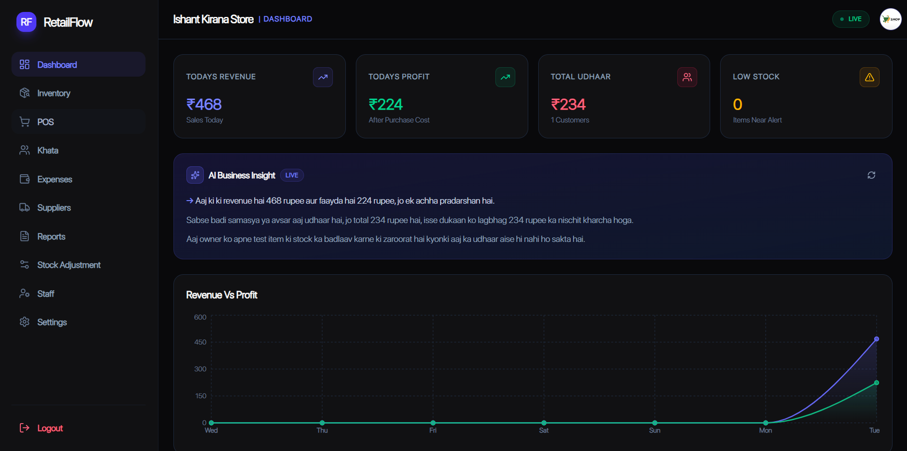
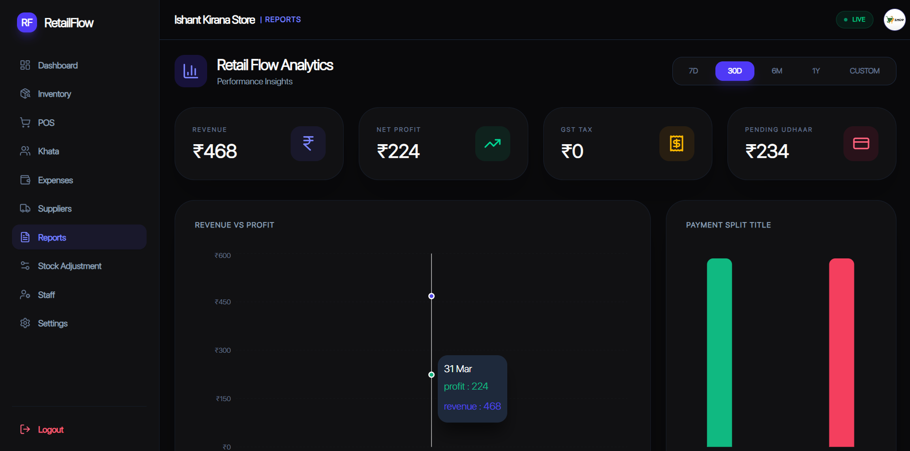
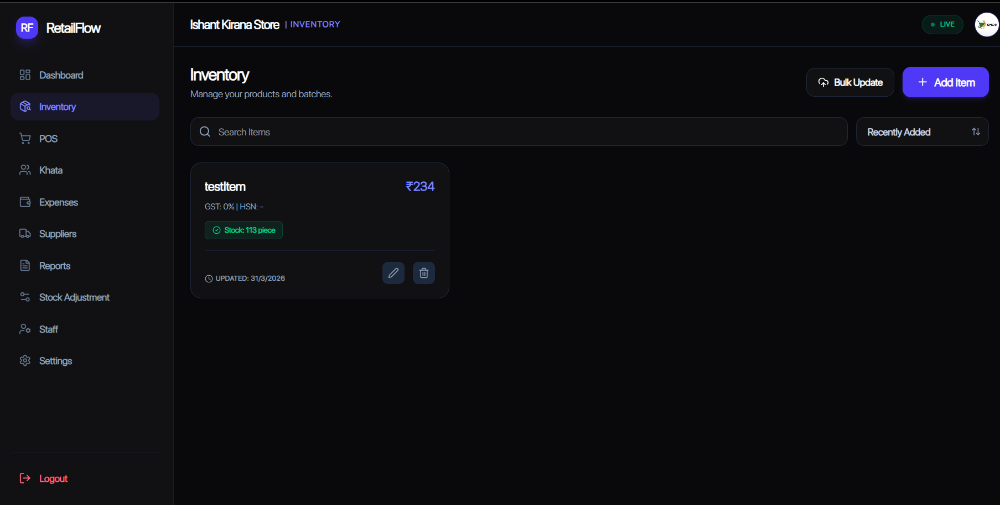
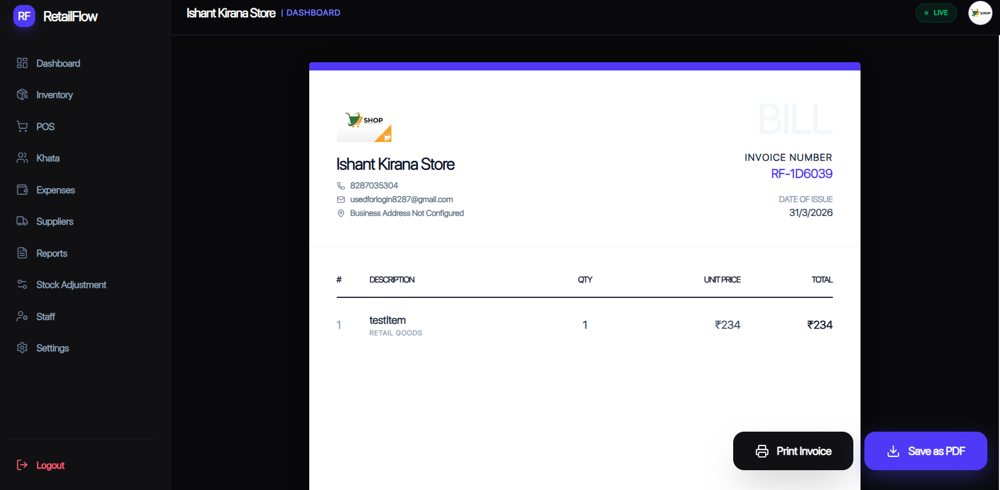
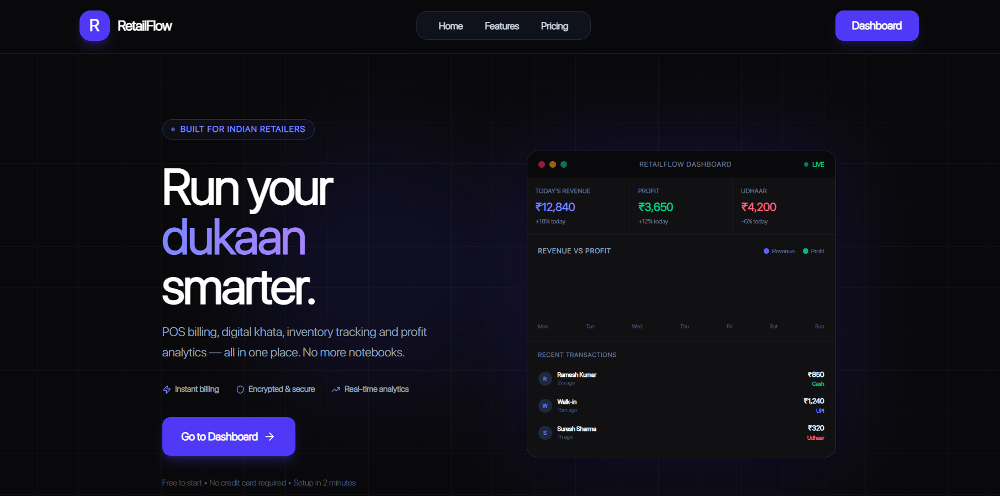
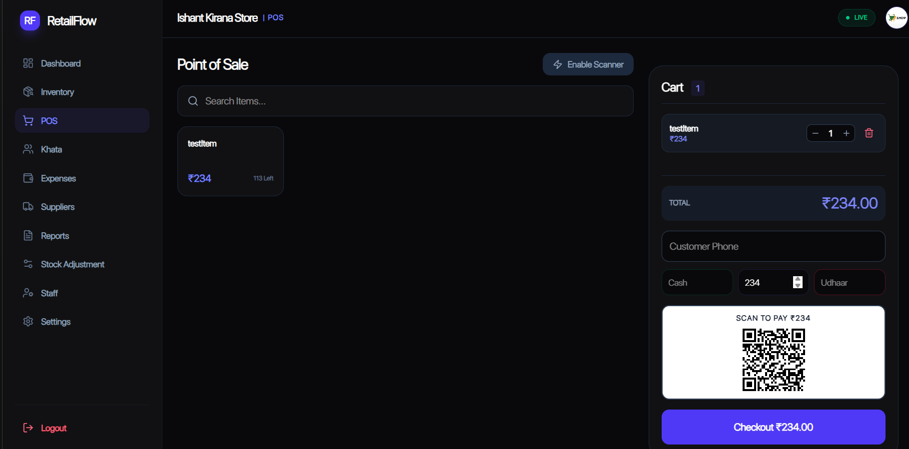
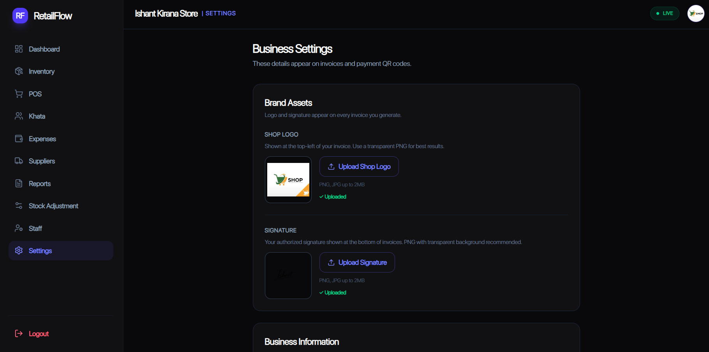

# RetailFlow

**Smart Retail & Inventory Management System for Indian Businesses**

RetailFlow is a full-stack SaaS POS and business management platform built for modern Indian retailers. It replaces notebooks, spreadsheets, and manual calculations with a fast, clean, and intelligent system.

---

## 🌐 Live Demo

🚀 **Frontend (Vercel)**
👉 https://retail-flow-xi.vercel.app/

⚙️ **Backend API (Render)**
👉 https://retailflow.onrender.com

📦 **GitHub Repository**
👉 https://github.com/Ishant8287/RetailFlow

---

## ✨ Features

| Feature                  | Description                                                                          |
| ------------------------ | ------------------------------------------------------------------------------------ |
| ⚡ Fast POS Billing       | Bill customers with split payments (Cash / UPI / Udhaar) and auto-generated invoices |
| 📖 Digital Khata         | Track udhaar, send reminders, set credit limits                                      |
| 📦 Smart Inventory       | Batch tracking, expiry alerts, low stock warnings                                    |
| 📊 Profit Analytics      | Revenue trends, top-selling items, payment breakdown                                 |
| 💸 Expense Tracker       | Track business expenses and calculate net profit                                     |
| 🚚 Supplier Management   | Manage purchases and supplier dues                                                   |
| 👥 Staff Management      | Role-based access (Owner / Manager / Cashier)                                        |
| 🤖 AI Business Insights  | AI-based suggestions using Groq (LLaMA 3.1)                                          |
| 🧾 Professional Invoices | PDF invoices with QR codes & GST details                                             |
| 🔐 Secure Auth           | OTP + JWT authentication                                                             |

---

## 📸 Screenshots

### 📊 Dashboard



### 📈 Analytics



### 📦 Inventory



### 🧾 Invoice



### 🏠 Landing Page



### ⚡ POS Billing



### ⚙️ Settings



---

## 🛠️ Tech Stack

### Frontend

* React 18 + Vite
* Tailwind CSS
* Recharts
* React Router
* React Hook Form + Zod
* jsPDF + QR Code

### Backend

* Node.js + Express.js
* MongoDB + Mongoose
* JWT Authentication
* bcrypt hashing
* Groq AI (LLaMA 3.1)
* Resend (OTP emails)
* ImageKit (uploads)

---

## 📁 Project Structure

```
retailflow/
├── retailflow-backend/
│   ├── controllers/
│   ├── models/
│   ├── routes/
│   ├── middlewares/
│   └── utils/
│
└── retailflow-frontend/
    ├── components/
    ├── pages/
    ├── api/
    └── assets/
```

---

## 🚀 Getting Started

### 1. Clone the repo

```
git clone https://github.com/Ishant8287/RetailFlow
cd retailflow
```

---

### 2. Backend Setup

```
cd retailflow-backend
npm install
```

Create `.env` file:

```
PORT=5000
MONGO_URI=your_mongodb_uri
JWT_SECRET=your_secret
GROQ_API_KEY=your_key
RESEND_API_KEY=your_key
```

Run:

```
npm run dev
```

---

### 3. Frontend Setup

```
cd retailflow-frontend
npm install
```

Create `.env`:

```
VITE_API_URL=http://localhost:5000/api/v1
```

Run:

```
npm run dev
```

---

## 🔑 API Overview

| Method | Endpoint             | Description   |
| ------ | -------------------- | ------------- |
| POST   | /auth/register       | Register shop |
| POST   | /auth/login-password | Login         |
| GET    | /items               | Get inventory |
| POST   | /sales               | Create sale   |
| GET    | /reports/dashboard   | Analytics     |

---

## 💡 Why This Project Stands Out

* Built a full backend from scratch (no Firebase)
* Real-world retail problem solving
* Atomic transactions using MongoDB sessions
* Production-ready security (JWT, hashing, rate limiting)
* AI-powered business insights integration
* Clean, scalable architecture

---

## 🌐 Deployment

* **Frontend** → Vercel
* **Backend** → Render 

---

## 📄 License

MIT License

---

## 🙌 Author

Built with ❤️ by Ishant Singh
